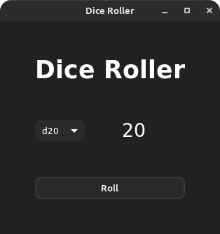

# Dice Roller GTK
 <br>
A dice roller implemented with C and GTK-4.

### Dependencies
Must have [GTK-4](https://www.gtk.org/docs/installations/linux/) installed on your system.

#### apt
```bash
apt install libgtk-4-1
```

#### pacman
```bash
pacman -S gtk4
```

#### dnf
```bash
dnf install gtk4
```

### Compiling

Remember you need the [development package](https://www.gtk.org/docs/installations/linux/) to compile.

#### apt
```bash
apt install libgtk-4-1 libgtk-4-dev
```

#### pacman
```bash
pacman -S gtk4
```

#### dnf
```bash
dnf install gtk4 gtk4-devel
```

Simply use make to compile with GCC
```bash
make
```

or you can modify the compiler inside the make file
```make
CC=your-compiler
```

